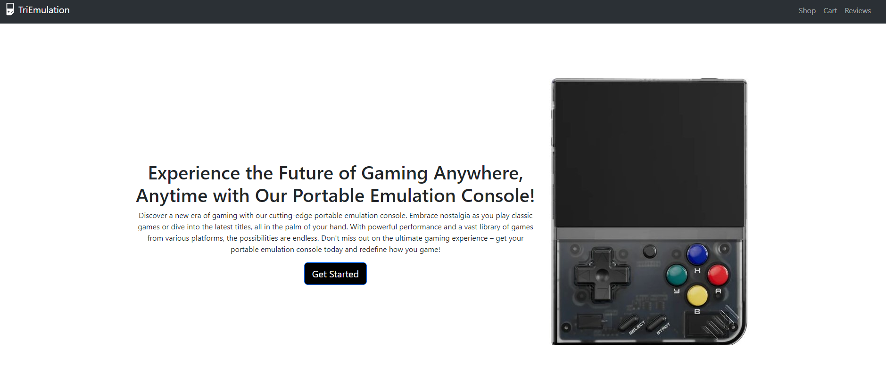

# Storefront Application


## Table of Contents

- [Introduction](#introduction)
- [Features](#features)
- [Getting Started](#getting-started)
  - [Prerequisites](#prerequisites)
  - [Installation](#installation)
- [Configuration](#configuration)
- [Contributing](#contributing)
-[Photos](#photos)

## Introduction

The Storefront Application is a for viewing and buying emulation consoles, This is a demonstration of React and uses full Crud in for the process.
This store features 8 react routes and all inline styling with the JSX.

## Features

- **Shopping Cart**: Customers can add products to their cart and proceed to checkout..
- **Responsive Design**: A mobile-friendly interface for shopping on any device.
- **Review Section**: A section where people and post and edit reviews.

## Getting Started

Follow these steps to get the Storefront Application up and running on your local machine.

### Prerequisites

- [Node.js](https://nodejs.org/)
- [npm](https://www.npmjs.com/)

### Installation

1. Clone this repository to your local machine:

   ```bash
   git clone https://github.com/Trizee/phase-2-project

## Contributions

- This is a page made by me, Tri Hoang for my Flatirons phase-2 project.

## Photos




